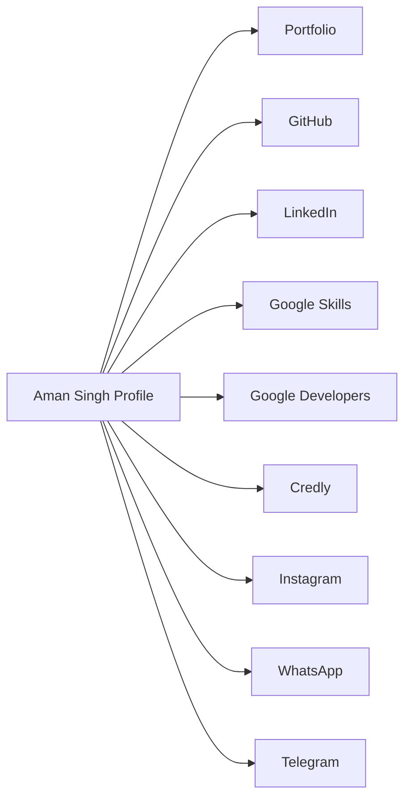

# Aman Singh AI Linktree

[](https://aman-singh-ai-linktree.vercel.app)
[](https://github.com)
[](LICENSE)

---

## 🔥 Project Overview

**Aman Singh AI Linktree** is a modern link-in-bio landing page built for AI, tech, and developer communities. It combines glassmorphism style, premium visual polish, animated backgrounds, and high-contrast link cards for fast access to portfolios, GitHub, LinkedIn, Google profiles, and more.

## 🎨 What makes it stylish?

- Premium frosted glass cards with smooth hover effects
- High-contrast typography for readability
- Floating tech symbols in the background for a futuristic feel
- Clean layout optimized for mobile and desktop
- Responsive design using modern CSS variables and animations

## 🚀 Features

- `index.html` — main landing page structure
- `style.css` — visual theme, glass effect, responsive styling
- `script.js` — icon initialization and optional animation hooks
- External Lucide icons for crisp SVG arrows and icon accents

## 📊 Link Flow



## 🛠️ How to run locally

```bash
cd aman-singh-ai-linktree
python -m http.server 8000
```

Then open `http://localhost:8000` in your browser.

## 📌 Recommended Preview

> Use a light or dark environment for best visual contrast. The cards are designed to feel premium and polished.

## 📷 Screenshot


## ✅ Project Notes

- The project is intentionally minimal and fast.
- Easy to update with new profile links and brand colors.
- Great for developers, creators, and AI enthusiasts looking for a clean personal hub.

